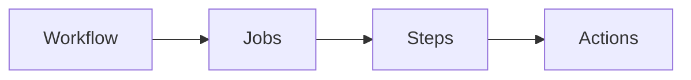
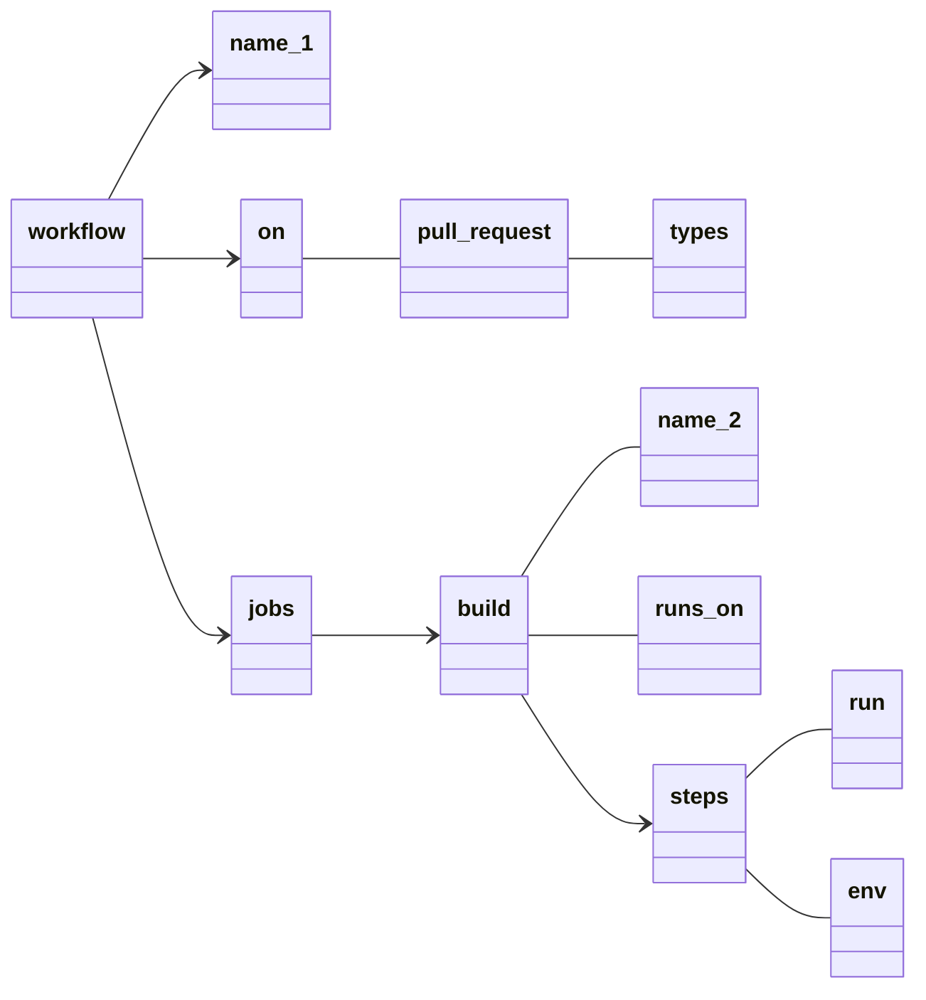

```mermaid
graph LR;
    Workflow-->Jobs;
    Jobs-->Steps;
    Steps-->Actions;
```

```mermaid  
classDiagram 
  direction LR
  workflow --> name_1
  workflow --> on
  workflow --> jobs
  on -- pull_request
  pull_request -- types
  jobs --> build
  build -- name_2
  build -- runs_on
  build --> steps
  steps -- run
  steps --env
```
